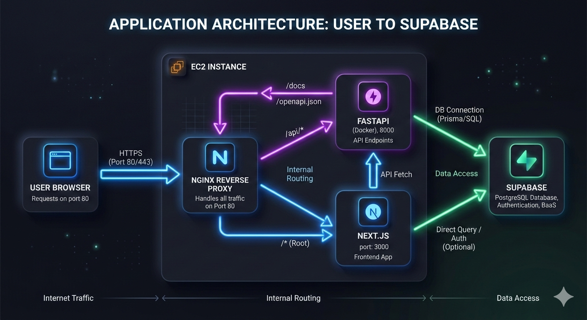
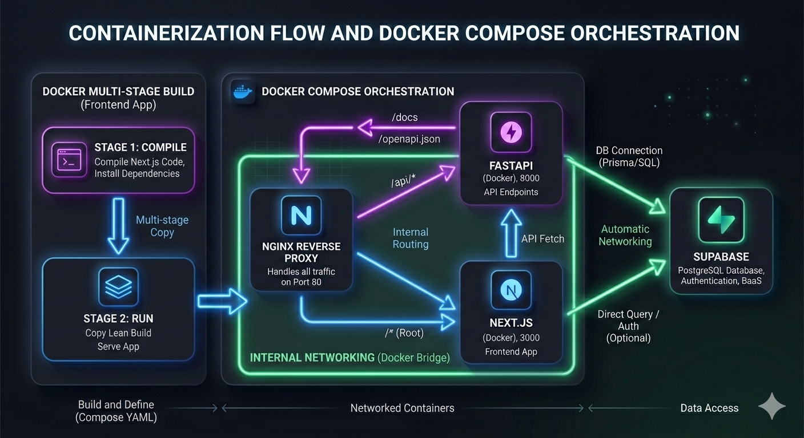

# EventSphere — Campus Event Platform

## Project Overview
EventSphere is a comprehensive, full-stack event management platform designed specifically for the students and faculty of Sahyadri College. It provides a centralized hub to discover, manage, and register for campus events. This is a production-deployed application built to demonstrate modern web development and deployment practices.

## Live Deployment
- **EC2 Public IP:** `3.110.208.37`
- **Frontend:** http://3.110.208.37
- **API Docs:** http://3.110.208.37/api/docs

## Tech Stack
| Component | Technology |
|---|---|
| **Backend** | FastAPI (Python 3.11) |
| **Frontend** | Next.js 16 (App Router) |
| **Database** | Supabase (PostgreSQL) |
| **Containerization** | Docker + Docker Compose |
| **Reverse Proxy** | Nginx |
| **Cloud** | AWS EC2 (t3.micro, Ubuntu 22.04) |

## Architecture

<div align="center">
  
</div>

```text
Browser
  ↓
EC2 Instance (Port 80)
  ↓
Nginx Container (Reverse Proxy)
  ├── /api/ → FastAPI Backend Container (Port 8000)
  └── /     → Next.js Frontend Container (Port 3000)
                      ↓
              Supabase (Remote PostgreSQL)
```

The architecture of EventSphere utilizes a containerized approach for scalability and consistency. The entry point for all incoming traffic is an AWS EC2 instance opening port 80 to the public. Behind this port sits an Nginx container acting as a reverse proxy. Nginx intelligently routes traffic based on the URL path: requests starting with `/api/` are forwarded to the FastAPI backend container running on port 8000, while all other requests (the root path `/`) are directed to the Next.js frontend container on port 3000. Finally, the backend container connects to a managed, remote PostgreSQL database hosted on Supabase to persist application data. This decoupled structure allows the frontend and backend to scale and update independently while maintaining a single unified origin for the client.

## Project Structure
```text
EventSphere/
├── backend/
│   ├── app/
│   ├── Dockerfile
│   ├── requirements.txt
│   └── .env (not committed)
├── frontend/
│   ├── app/
│   ├── Dockerfile
│   └── next.config.ts
├── nginx/
│   └── nginx.conf
└── docker-compose.yml
```

## Docker Implementation

### Why Docker
Docker containerization ensures that our application runs identically regardless of where it is deployed—eliminating the classic "it works on my machine" problem. By packaging the application code, dependencies, and system libraries together into self-contained images, we avoid dependency conflicts and ensure a consistent environment from local development to the final EC2 production server.

### Backend Dockerfile
```dockerfile
FROM python:3.11-slim
WORKDIR /app
COPY requirements.txt .
RUN pip install --no-cache-dir -r requirements.txt
COPY . .
EXPOSE 8000
CMD ["uvicorn", "app.main:app", "--host", "0.0.0.0", "--port", "8000"]
```
- `FROM python:3.11-slim`: Starts from a minimal Python 3.11 image to reduce the final image size.
- `WORKDIR /app`: Sets the working directory inside the container.
- `COPY requirements.txt .`: Copies only the dependency list first to leverage Docker's layer caching.
- `RUN pip install --no-cache-dir -r requirements.txt`: Installs dependencies without caching the downloaded packages, keeping the image small.
- `COPY . .`: Copies the rest of the application code into the container.
- `EXPOSE 8000`: Documents that the container listens on port 8000.
- `CMD [...]`: The default command to start the FastAPI server using Uvicorn.

### Frontend Dockerfile
```dockerfile
# Stage 1: builder
FROM node:20-alpine AS builder
WORKDIR /app
COPY package*.json ./
RUN npm ci
COPY . .
RUN npm run build

# Stage 2: runner
FROM node:20-alpine AS runner
WORKDIR /app
ENV NODE_ENV production
COPY --from=builder /app/.next/standalone ./
COPY --from=builder /app/.next/static ./.next/static
COPY --from=builder /app/public ./public
EXPOSE 3000
CMD ["node", "server.js"]
```
This multi-stage build significantly reduces the final image footprint. In Stage 1 (`builder`), all dependencies (including dev dependencies) are installed to build the Next.js application. In Stage 2 (`runner`), we start with a fresh image and only copy over the essential compiled artifacts (`.next/standalone`, static files, and public assets) from the builder stage. This means the final production image doesn't carry the weight of unnecessary source code or heavy node_modules required only for the build process, resulting in a leaner, more secure container.

### docker-compose.yml

<div align="center">
  
</div>

```yaml
version: '3.8'
services:
  backend:
    build: ./backend
    env_file: ./backend/.env
    restart: always

  frontend:
    build: ./frontend
    restart: always

  nginx:
    image: nginx:alpine
    ports:
      - "80:80"
    volumes:
      - ./nginx/nginx.conf:/etc/nginx/nginx.conf:ro
    depends_on:
      - backend
      - frontend
    restart: always
```
- **3 Services:** Orchestrates `backend`, `frontend`, and `nginx` containers together.
- **Internal Networking:** Services communicate seamlessly using their defined names (e.g., Nginx refers to the backend as `http://backend:8000`).
- **Public Port:** Only Nginx exposes port `80` to the host machine; the backend and frontend remain inaccessible directly from the outside.
- **Restart Policy:** `restart: always` ensures that if a container crashes or the EC2 server reboots, the services will automatically spin back up, ensuring high availability.
- **env_file Injection:** Securely loads environment variables into the backend container from the `.env` file without hardcoding secrets in the configuration.

## Nginx Reverse Proxy

### Configuration
```nginx
events {}

http {
    server {
        listen 80;

        location /api/ {
            proxy_pass http://backend:8000/api/;
            proxy_set_header Host $host;
            proxy_set_header X-Real-IP $remote_addr;
            proxy_set_header X-Forwarded-For $proxy_add_x_forwarded_for;
        }

        location / {
            proxy_pass http://frontend:3000/;
            proxy_set_header Host $host;
            proxy_set_header X-Real-IP $remote_addr;
            proxy_set_header X-Forwarded-For $proxy_add_x_forwarded_for;
        }
    }
}
```
- **Server Block:** A single server block listens for incoming HTTP traffic on port 80.
- **`location /api/`**: Matches any request starting with `/api/` and proxies it to the internal `backend` container on port 8000.
- **`location /`**: Acts as a catch-all for any other requests and routes them to the `frontend` container on port 3000.
- **`proxy_set_header`**: These directives are crucial for passing original client information (like IP address and hostname) through the proxy to the upstream applications, ensuring they handle requests accurately.

## HTTP Routing Flow
1. User visits `http://3.110.208.37/`:
   - The request hits the EC2 instance on port 80.
   - Nginx receives the request, matches the `location /` block, and forwards it to the Next.js frontend container.
   - The frontend container renders the homepage and sends the HTML response back through Nginx to the user's browser.
2. User visits `http://3.110.208.37/api/events/`:
   - The request hits port 80.
   - Nginx matches the `location /api/` block and proxies the request to the FastAPI backend container.
   - The backend processes the API request, fetches data from Supabase, and returns a JSON response back through Nginx.

## Networking & Security

### Port Mapping Table
| Port | Service | Exposed To | Reason |
|------|---------|------------|--------|
| **80** | Nginx | Public internet | HTTP entry point for all application traffic |
| **22** | SSH | My IP only | Secure server management and deployment |
| **8000** | FastAPI | Internal only | Proxied via Nginx; securely hidden from public access |
| **3000** | Next.js | Internal only | Proxied via Nginx; securely hidden from public access |
| **5432** | Supabase | External (Supabase cloud) | Managed database communication |

### Security Decisions
- **Strict Security Group:** Only ports 80 (HTTP) and 22 (SSH) are open to the internet. Port 22 is further restricted to a specific IP to prevent unauthorized server access.
- **Internal Ports:** Backend (8000) and Frontend (3000) ports are bound only to the internal Docker network. This prevents direct external requests from bypassing the Nginx entry point.
- **Secret Management:** Sensitive credentials, like database URLs and secret keys, are stored in a `.env` file that is explicitly ignored by version control. This prevents exposing secrets in the GitHub repository.
- **High Availability:** Setting `restart: always` on all Docker containers guarantees that the system automatically recovers from transient failures or host reboots, which is a baseline requirement for production workloads.

## Environment Variables
The backend requires the following environment variables defined in `backend/.env`:
- `DATABASE_URL`: The connection string for the remote Supabase PostgreSQL database.
- `SECRET_KEY`: A robust, cryptographic key used for signing JWTs and managing session security.
- `ALGORITHM`: The hashing algorithm used for JWTs (e.g., `HS256`).

*Note: The frontend API URL is injected at build time via `NEXT_PUBLIC_API_URL` based on Next.js build-time environment variable conventions.*

## Deployment Guide

### Prerequisites
- An AWS EC2 instance running Ubuntu 22.04.
- Docker and Docker Compose installed on the host machine.
- Git installed for version control.

### Steps
1. **SSH into EC2:** Connect to your server.
2. **Clone repo:** Fetch the latest code.
3. **Create secrets:** Manually create `backend/.env` with the production database credentials.
4. **Deploy:** Run `docker-compose up --build -d` to build the images and start the containers in detached mode.
5. **Verify:** Check the process status with `docker-compose ps`.
6. **Access:** Open a web browser to `http://<EC2_IP>` to view the live application.

### Useful Commands
```bash
docker-compose up --build -d     # Build and start all containers
docker-compose ps                # Check container status
docker-compose logs backend      # View backend logs
docker-compose logs frontend     # View frontend logs
docker-compose down              # Stop all containers
docker system prune -f           # Clean up unused images
```

## Serverful vs Serverless

### This Project (Serverful — EC2)
- Always running server instance.
- Full control over the environment and underlying infrastructure.
- Fixed monthly cost regardless of fluctuating traffic.
- Docker containers run consistently as defined.
- Scaling requires manual intervention or complex auto-scaling configurations.

### Serverless Alternative (AWS Lambda / Vercel Functions)
- Code only executes when triggered by a request.
- Scales automatically up (and down to zero) based on demand.
- Pay-per-execution billing model.
- Zero server management or OS patching required.
- Susceptible to "cold start" latency when spinning up new instances.

### Why We Chose EC2
For this project, EC2 was deliberately chosen because deploying a complete Docker ecosystem (including Nginx configuration) requires a persistent, running host. This serverful approach provides granular control over the reverse proxy and networking layers. Crucially, it demonstrates foundational production deployment skills and fulfills the specific grading requirement to architect a containerized application deployment.

## Functional Scope
- **User Module:** Ability to view all available events, inspect event details, and register for participation.
- **Admin Module:** Capabilities to create new events, edit existing ones, and view attendee registrations.

*Note: Advanced features such as payment integration, QR code ticketing, and analytics were explicitly not required per the project specification.*

## Evaluation Coverage
| Requirement | Implementation | Weight |
|---|---|---|
| **Application Functionality** | FastAPI + Next.js + Supabase database integration | 30% |
| **Docker Implementation** | Optimized multi-stage Dockerfiles + tailored docker-compose stack | 20% |
| **Nginx Reverse Proxy** | Custom `nginx.conf` utilizing precise location routing blocks | 20% |
| **Networking & Security** | AWS Security groups limiting access + isolated internal Docker ports | 10% |
| **Architecture Documentation** | This comprehensive deployment README | 20% |
